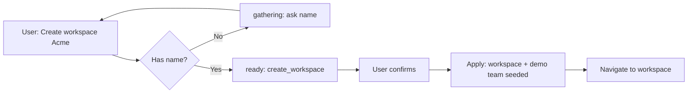
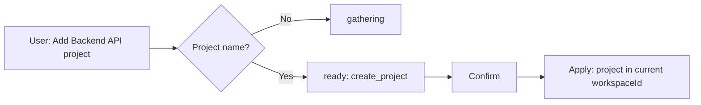
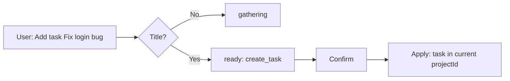
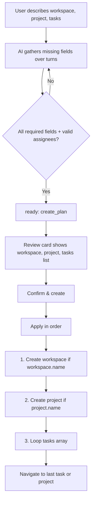
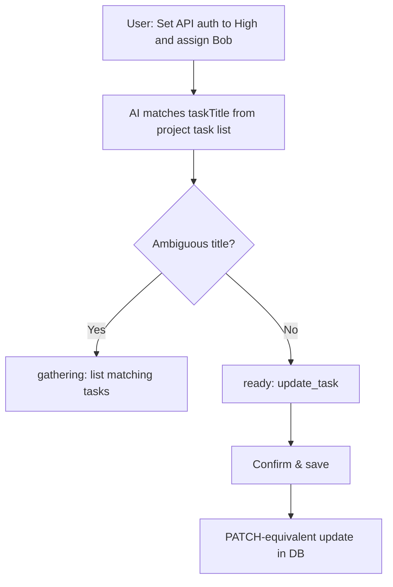
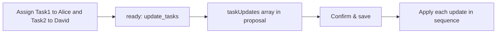
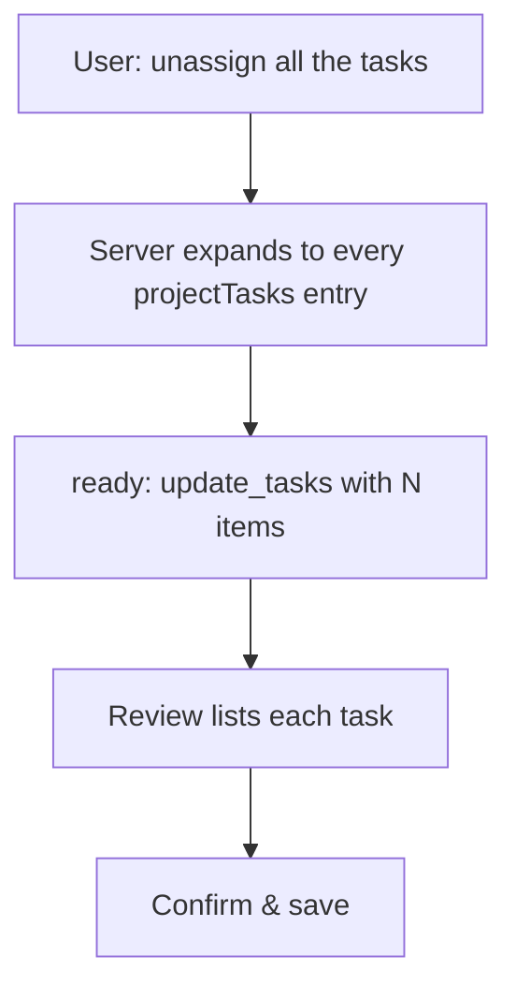
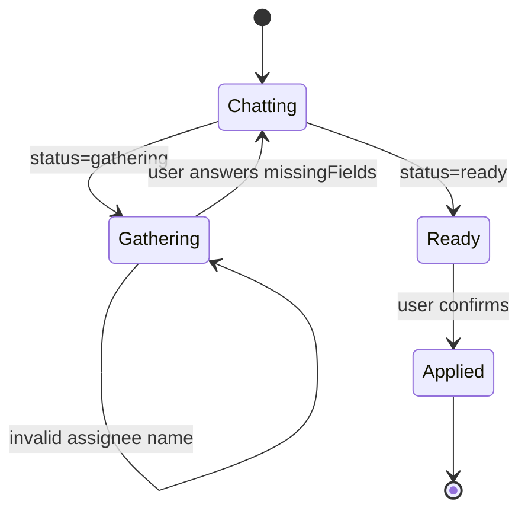

# TeamFlow — AI Planner Flows

This document describes **end-to-end AI user flows**: where the assistant is available, how conversations progress, what gets created or updated, and what stays manual.

For HTTP API details see [api-endpoints.md](./api-endpoints.md#ai-planner). For backend implementation see [ai-server.md](./ai-server.md).

---

## Core pattern (all AI actions)

Every AI action follows the same **chat → review → apply** pattern. Nothing is saved until the user clicks **Confirm & create** or **Confirm & save**.

```mermaid
sequenceDiagram
    participant U as User
    participant UI as AI Blade (frontend)
    participant API as Backend /api/ai
    participant OAI as OpenAI
    participant DB as MongoDB

    U->>UI: Open "Plan with AI" + send message
    UI->>API: POST /ai/chat { messages, context }
    API->>DB: Load context (workspaces, roster, tasks)
    API->>OAI: System prompt + conversation
    OAI->>API: JSON { message, status, proposal? }
    API->>API: Enrich & validate proposal
    API->>UI: Assistant reply + proposal if ready

    alt status = gathering
        UI->>U: Show reply; ask follow-up
        U->>UI: Send another message
        UI->>API: POST /ai/chat (full history)
    else status = ready
        UI->>U: Show proposal summary + confirm button
        U->>UI: Confirm & create/save
        UI->>API: POST /ai/apply { proposal }
        API->>DB: Create / update entities
        API->>UI: Success + navigation / refresh
    end
```

| Step | `status` | UI state |
|------|----------|----------|
| Missing info | `gathering` | Chat only; no confirm button |
| Ready to save | `ready` | Green review card + **Confirm** |
| After apply | — | Toast, cache refresh, navigate to new entity |

---

## Where AI is available

| Page | Button | `context.page` | Default AI focus |
|------|--------|----------------|------------------|
| Dashboard | Plan with AI | `dashboard` | Workspace + project + tasks in one plan |
| Workspace detail | Plan with AI | `workspace` | New project in this workspace |
| Project detail | Plan with AI | `project` | Create tasks; update tasks **by title** |
| Task detail | Plan with AI | `task` | Update **this task**; create more tasks in project |

Context IDs (`workspaceId`, `projectId`, `taskId`) are sent automatically from the current page so the server knows which roster and task list to use.

---

## Flow 1 — Create workspace only

**Page:** Dashboard (or any page with dashboard context)



**Proposal:** `action: "create_workspace"`, `workspace: { name, description? }`

**After apply:** Workspace created; user becomes owner; Alice, Bob, Carol, David seeded as `team_members`.

---

## Flow 2 — Create project in existing workspace

**Page:** Workspace detail



**Proposal:** `action: "create_project"`, `workspaceId`, `project: { name, description?, color? }`

**Color:** User can say "red" or "blue"; AI must not ask for hex codes.

---

## Flow 3 — Create one task

**Page:** Project detail



**Proposal:** `action: "create_task"`, `projectId`, `task: { title, description?, priority?, assigneeName? }`

---

## Flow 4 — Create workspace + project + multiple tasks (plan)

**Page:** Dashboard (typical)

This is the most common capstone demo flow: one conversation, one confirm, everything created.



**Proposal:**

```json
{
  "action": "create_plan",
  "workspace": { "name": "...", "description": "..." },
  "project": { "name": "...", "description": "...", "color": "red" },
  "tasks": [
    { "title": "Task1", "description": "...", "priority": "Low", "assigneeName": "Alice Chen" },
    { "title": "Task2", "priority": "Medium", "assigneeName": "David Kim" }
  ]
}
```

**Conversation tips:**

- User can send everything in one message or across several turns.
- Assignees must be from the demo roster (or existing workspace team).
- Priorities: `Low`, `Medium`, `High`, `Urgent` (server normalizes casing on apply).
- Unassigned tasks: omit `assigneeName`.

**Example prompt:**

> Create workspace "Capstone", project "API" in blue, and tasks: Setup repo (High, Bob), Write docs (Low, unassigned).

---

## Flow 5 — Update one task by title

**Page:** Project detail or task detail



**On task page:** If user does not name another task, server defaults to **current task**.

**Proposal:** `action: "update_task"`, `taskTitle`, `task: { priority?, status?, assigneeName?, clearAssignee?, ... }`

---

## Flow 6 — Update multiple tasks (batch)

**Page:** Project detail

When the user names **two or more tasks** in one request:



**Proposal:**

```json
{
  "action": "update_tasks",
  "taskUpdates": [
    { "taskTitle": "Task1", "assigneeName": "Alice Chen" },
    { "taskTitle": "Task2", "assigneeName": "David Kim" }
  ]
}
```

---

## Flow 7 — Update all tasks in project

**Page:** Project detail (must have project context so `projectTasks` is loaded)

Phrases: *"unassign all tasks"*, *"assign every task to David"*, *"mark all tasks Done"*.



**Mechanism:** Chat enrichment detects "all tasks" language and builds `taskUpdates[]` from the project task list. For unassign, each entry gets `clearAssignee: true`.

**If no project context:** AI asks user to open a project page first.

---

## Flow 8 — Gathering loop (multi-turn)



**Common `missingFields`:** workspace name, project name, task titles, assignee clarification, duplicate task title disambiguation.

**Invalid assignee:** AI lists roster names and stays in `gathering` until a valid name is chosen.

---

## Assignee rules

| Situation | Behavior |
|-----------|----------|
| New workspace in plan | `assigneeName` only (Alice Chen, Bob Martinez, Carol Nguyen, David Kim) |
| Existing workspace | Name matched to `team_members`; real MongoDB id resolved on apply |
| Unassign | `clearAssignee: true` |
| User asks "who can I assign?" | AI must list full roster in the reply |

Assignees are **team members**, not login users. Assigning Alice does not log anyone in unless they have a real account and were invited.

---

## AI vs manual UI

| Action | AI | Manual UI |
|--------|----|-----------|
| Create workspace / project / task | Yes | Create buttons |
| Update task fields | Yes (task / project page) | Edit on task page |
| Edit workspace / project settings | No | Edit dialogs |
| Invite / remove members | No | Workspace invite UI |
| Delete anything | No | Admin buttons |
| Comments | No | Task comment form |

---

## Error paths

| Scenario | UX |
|----------|-----|
| Not logged in | 401; redirect to login |
| `OPENAI_API_KEY` missing on server | 503; toast error |
| Invalid proposal on apply | 400 Validation failed; toast with detail |
| Backend down / cold start | 502 from Vercel proxy; retry |
| Duplicate task title on update | `gathering`; AI lists tasks to pick from |
| "All tasks" on dashboard | `gathering`; open a project first |

---

## Example conversations

### Full plan (dashboard)

1. **User:** Create a workspace for our capstone with a Backend project and 3 tasks.  
2. **AI:** What's the workspace called?  
3. **User:** Capstone Team — building our final project.  
4. **AI:** Project name and task details?  
5. **User:** Project API. Tasks: Auth (High, Bob), Database (Medium, Alice), Tests (Low, David).  
6. **AI:** Ready to create — review summary.  
7. **User:** Confirm & create.

### Batch assign (project page)

1. **User:** Assign Task1 to Alice and Task2 to David.  
2. **AI:** Ready to save — lists both updates.  
3. **User:** Confirm & save.

### Unassign all (project page)

1. **User:** Unassign all the tasks.  
2. **AI:** I'll unassign all N tasks in this project. Review below.  
3. **User:** Confirm & save.

---

## Related docs

| Document | Content |
|----------|---------|
| [ai-server.md](./ai-server.md) | Backend services, validation, file map |
| [api-endpoints.md](./api-endpoints.md#ai-planner) | REST contract |
| [user-flow.md](./user-flow.md) | Non-AI app journeys |
| [deployment-guide.md](./deployment-guide.md) | `OPENAI_API_KEY` on Render |
