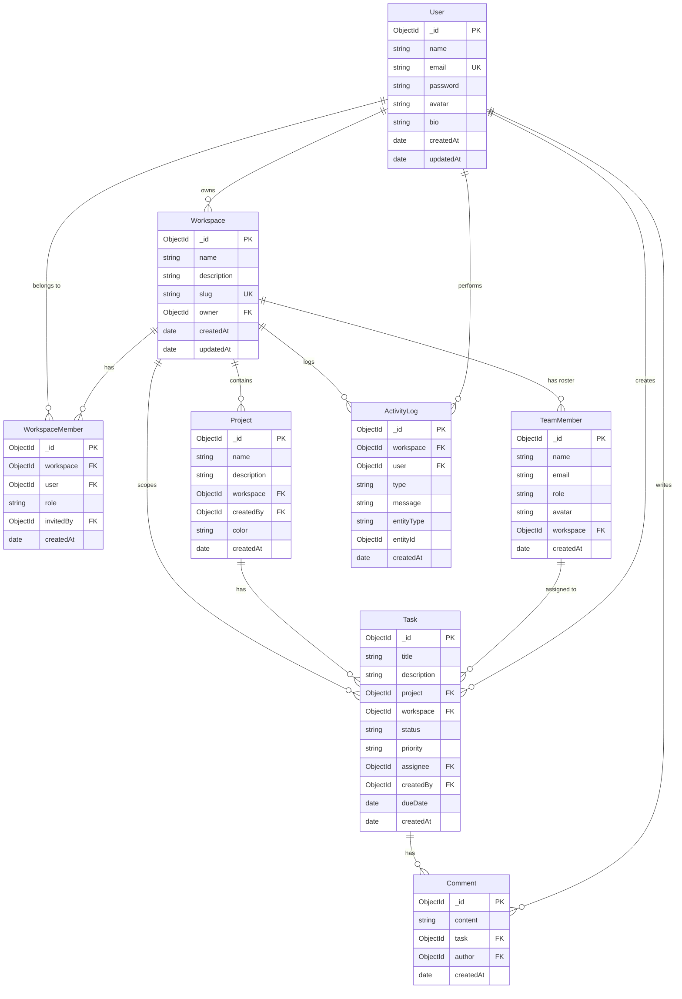

# TeamFlow — Database ERD

## Entity-Relationship Diagram



## Collections

| MongoDB collection | Model | Purpose |
|--------------------|-------|---------|
| `users` | User | Login accounts |
| `workspaces` | Workspace | Teams |
| `workspacemembers` | WorkspaceMember | App user access + roles |
| `team_members` | TeamMember | Assignable roster per workspace |
| `projects` | Project | Projects |
| `tasks` | Task | Tasks (`assignee` → TeamMember) |
| `comments` | Comment | Task comments |
| `activitylogs` | ActivityLog | Audit trail |

## Indexes

| Collection | Index | Purpose |
|------------|-------|---------|
| User | email (unique) | Login lookup |
| Workspace | slug (unique), owner | Routing |
| WorkspaceMember | workspace + user (unique) | Membership |
| TeamMember | workspace + email (unique) | Roster per workspace |
| Task | project + status, text(title, description) | Filters & search |
| ActivityLog | workspace + createdAt | Timeline |

## Relations Summary

- **User → Workspace**: one-to-many (owner)
- **User ↔ Workspace**: many-to-many via WorkspaceMember (auth access)
- **Workspace → TeamMember**: one-to-many (task assignee roster)
- **Workspace → Project**: one-to-many
- **Project → Task**: one-to-many
- **TeamMember → Task**: one-to-many (assignee)
- **Task → Comment**: one-to-many
- **Workspace → ActivityLog**: one-to-many

## Migrations

After changing task assignee from User to TeamMember, run:

```bash
cd backend
npm run migrate:task-assignees
```

This clears assignees that are not valid `team_members` in the same workspace.
