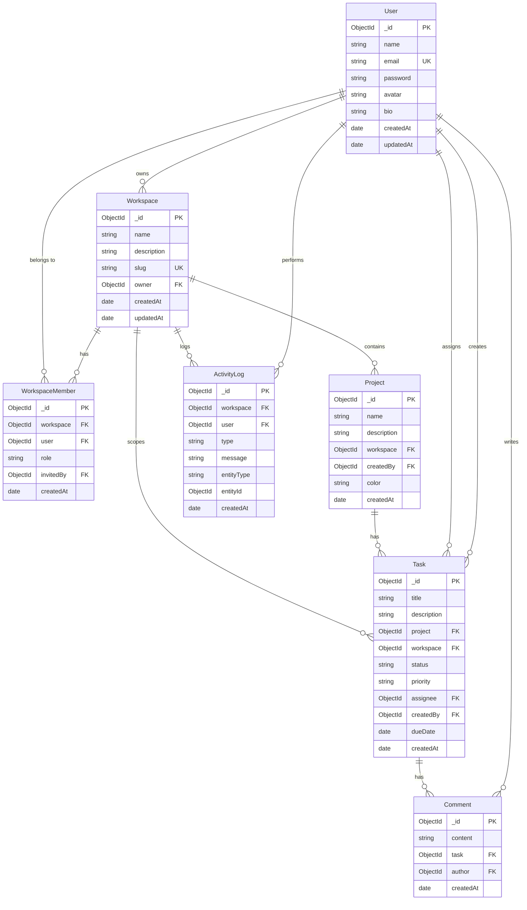

# TeamFlow — Database ERD

## Entity-Relationship Diagram

## Indexes

| Collection | Index | Purpose |
|------------|-------|---------|
| User | email (unique) | Login lookup |
| Workspace | slug (unique), owner | Routing |
| WorkspaceMember | workspace + user (unique) | Membership |
| Task | project + status, text(title, description) | Filters & search |
| ActivityLog | workspace + createdAt | Timeline |

## Relations Summary

- **User → Workspace**: one-to-many (owner)
- **User ↔ Workspace**: many-to-many via WorkspaceMember
- **Workspace → Project**: one-to-many
- **Project → Task**: one-to-many
- **Task → Comment**: one-to-many
- **Workspace → ActivityLog**: one-to-many
