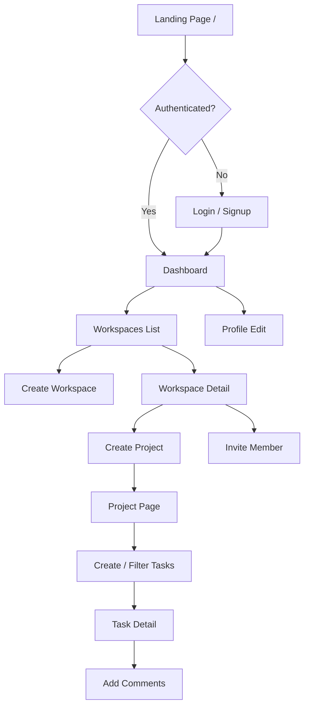
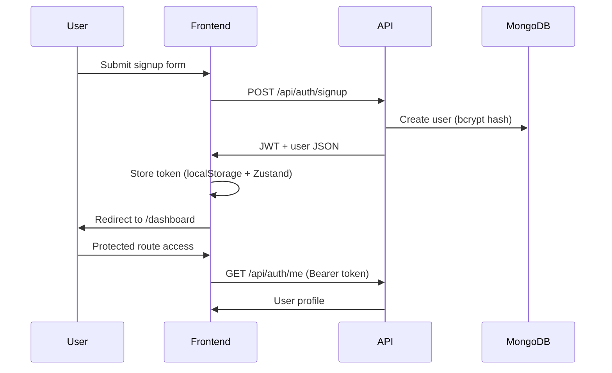

# TeamFlow — User Flow

## Primary Journey



## Authentication Flow



## Workspace Collaboration Flow

1. User creates workspace → becomes **owner** + WorkspaceMember record; four demo **team members** are seeded for task assignment
2. Owner/admin invites a **login user** by email → invitee must already have signed up (`users` collection)
3. Only the **owner** can invite someone with the **admin** role
4. All members can create projects and tasks; only **admin/owner** can edit or delete projects and delete tasks
5. Tasks inherit `workspace` reference for access checks and activity logs
6. Assigning a task to “Alice Chen” updates the `team_members` assignee — it does **not** notify or log in a user at `alice@teamflow.demo` unless that person has a separate login account and was invited to the workspace

## Roles

| Role | Typical UI |
|------|------------|
| owner | Full control; invite admins; delete workspace |
| admin | Edit/delete projects; delete tasks; invite/remove members |
| member | Create tasks; update tasks; no project edit/delete or task delete buttons |

## Task Lifecycle

```
Todo → In Progress → Review → Done
```

Priorities: Low, Medium, High, Urgent

Each create/update/delete logs an ActivityLog entry visible on workspace timeline.

## Error Paths

| Scenario | UX |
|----------|-----|
| Invalid login | Alert on login form |
| 401 expired token | Redirect to /login |
| No workspaces | Empty state + CTA |
| Invite unknown email | Toast error "User must sign up first" |
| Non-admin tries delete project/task | 403 from API; buttons hidden in UI |
| Delete someone else's comment | 403 "You can only delete your own comments" |
| Admin invites admin | 403 unless actor is workspace owner |
| Remove yourself from workspace | 403 "You cannot remove yourself" |

## AI planner flows

For conversational create/update flows (Plan with AI, confirm before save), see [ai-flows.md](./ai-flows.md).
