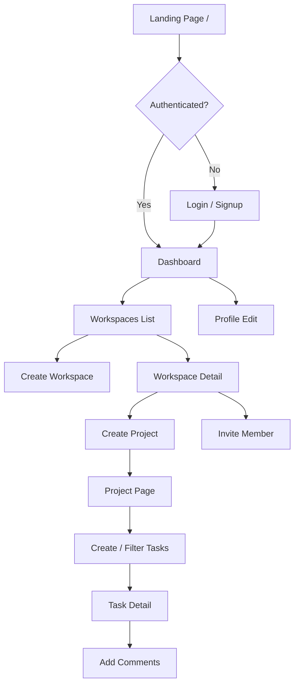
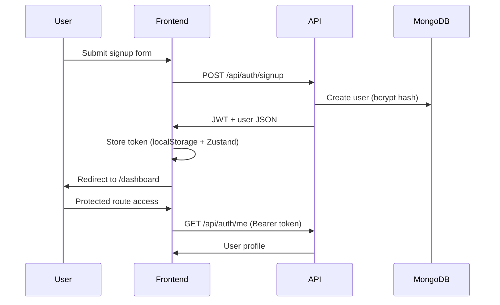

# TeamFlow — User Flow

## Primary Journey



## Authentication Flow



## Workspace Collaboration Flow

1. User creates workspace → becomes **owner** + WorkspaceMember record
2. Owner/admin invites member by email → member must exist in system
3. Members create projects within workspace
4. Tasks inherit `workspace` reference for access checks and activity logs

## Task Lifecycle

```
Todo → In Progress → Review → Done
```

Priorities: Low, Medium, High, Urgent

Each create/update/delete logs an ActivityLog entry visible on workspace timeline.

## Error Paths

| Scenario | UX |
|----------|-----|
| Invalid login | Alert on login form |
| 401 expired token | Redirect to /login |
| No workspaces | Empty state + CTA |
| Invite unknown email | Toast error "User must sign up first" |
